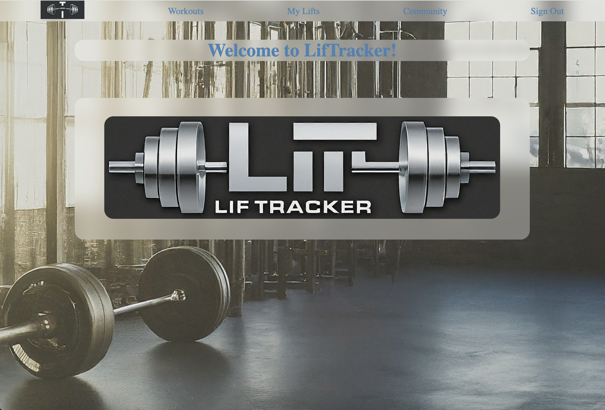
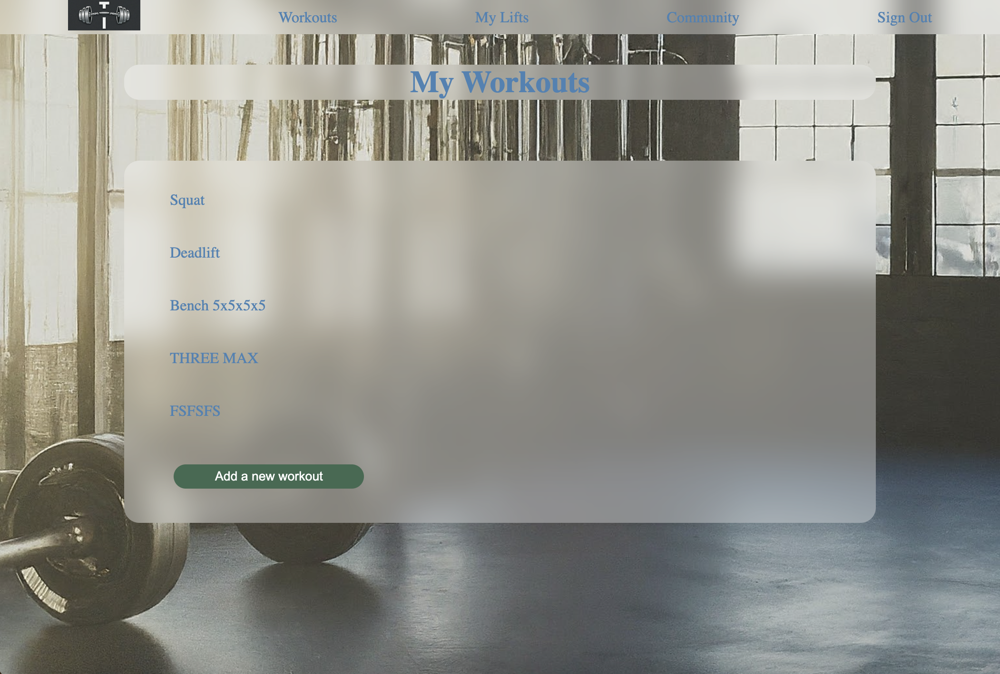

# Welcome to LifTracker!
## Screenshots
1. 
1. 
1. ![A [age showing today's Squat workout and the sets and reps needed]](./public/assets/screenshotOne.png)
1. 

## The App
LifTracker is an app for recording your progress as you lift weights. You can store different personal records (PRs) in single, three, and five repetition maximum weights. Once you've stored some lifts, you can create workouts to help you progress. You can design your workouts to include as many lifts as you'd like, adding additional activities as necessary and specifying the number of sets, reps, and percent of your training max weight.

You can see the names of other users' workouts in addition to being able to create, read, update, and delete your own workouts and lifts.

This app was designed in part to help my wife compute the necessary weights for programming she's using in real life as it gets tedious to constantly recalculate a fixed percentage of a moving target. It's also something I've spent a lot of time with and can use in my daily life.

## Getting Started
If you want to dive right in you can [start here.](https://notZeke.com/)
The original wireframes of the planning process can be found [here](./public/assets/wireframeOne.png), [here](./public/assets/wireframeTwo.png), [and here.](./public/assets/wireframeThree.png)
Entity Relationship Diagram can be [found here.](.public/assets/liftracker%20erd.png)
Route Tables can be found [here.](./public/assets/Route%20Tables.pdf)

## Attributions
1. [Google Fonts](https://fonts.google.com/) for the in game typography.
2. [Google Gemini](https://gemini.google.com/) helped with the concept art, background image, and logos.

## Technologies Used
This app is an example of a classic MEN stack app primary libraries include:
MongoDB
Mongoose
Express
Node.js
Bcrypt
Dotenv
Express-Session
Method Override
and Morgan for dev help.

## Next Steps
Continued rendering enhancements across devices:
1. Save progress during workout creation if a new activity is added.
1. Mobile optimization. Because this is full stack, it was developed primarily for a desktop environment.
2. Make everything easier with a touch screen and phone keyboard.
3. Add the ability favorite workouts and have them float to the top.
4. Share the details of workouts with other users so they can try them with their own weights.